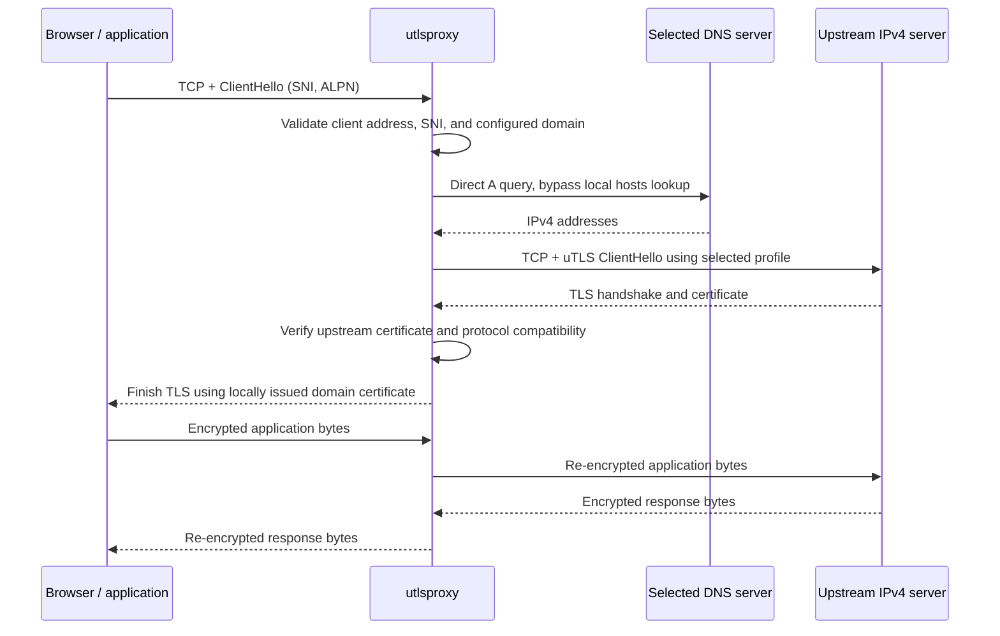

# utlsproxy project specification

Status: approved implementation contract, revision 2 (explicit CA trust commands); development implementation available

Date: 2026-09-13

Companion document: [Delivery summary](DELIVERY.md)

## 1. Purpose and naming

`utlsproxy` is a small Go daemon that changes the upstream TLS ClientHello of selected HTTPS connections originating from a user's machine. Domain names are redirected to the daemon through hosts-file entries. The daemon terminates client TLS, establishes verified upstream TLS using `github.com/refraction-networking/utls`, and relays the application byte stream.

The project and executable are named `utlsproxy`; the Go module is `github.com/unixapple/utlsproxy`. The project is licensed under BSD 3-Clause. This specification does not rename the existing workspace directory.

The terms MUST, SHOULD, and MAY express project requirements. Defaults and interfaces below are design decisions; cited references establish underlying platform or protocol behavior. This is the requirements contract, not a claim that all acceptance criteria have passed. See [README.md](README.md) and [the validation record](docs/VALIDATION.md) for the implemented development release and known limitations.

## 2. Version 1 scope

### 2.1 Required capabilities

- Go implementation, with macOS and Linux binaries for `arm64` and `amd64`.
- One executable containing the foreground daemon, administrative CLI, and service installer.
- IPv4 TCP listeners on loopback or an explicitly configured LAN address.
- Routing by visible TLS SNI, limited to configured exact domain names.
- Local CA generation; explicit CLI-managed or manual installation of the public CA certificate into client trust stores.
- Automatic issuance and caching of certificates for configured domains.
- Upstream TLS customization through named uTLS profiles selected by CLI or JSON configuration.
- Direct IPv4 DNS queries, with automatic discovery of the machine's current DNS servers or explicitly configured DNS servers.
- HTTP/1.1 and HTTP/2 stream relay when application protocol negotiation is compatible.
- Local inspection of daemon health, connections, DNS discovery, and configuration.
- Optional management of a dedicated block in the local hosts file.
- System service installation, startup at boot, and restart after process failure.

### 2.2 Excluded from version 1

- IPv6 listeners, upstream connections, DNS transport, AAAA queries, and IPv6 hosts entries. The application does not disable IPv6 on the operating system or guarantee interception of traffic using it.
- QUIC or HTTP/3 termination. UDP/443 is left unbound; browser fallback to TCP is the normal deployment model.
- HTTP parsing, URL routing, header rewriting, HTTP/2 fingerprint rewriting, or HTTP request metrics.
- Plain HTTP on port 80, CONNECT/SOCKS proxy protocols, TUN devices, packet redirection, and firewall changes.
- Decrypting real ECH, transparent forwarding of client certificate authentication, and bypassing application certificate pinning.
- Implicit trust-store installation/removal during CA generation, daemon startup, service installation or service uninstall. Trust changes require a separate explicit command.
- Serving DNS to other programs, changing the host's DNS settings, DNS-over-HTTPS, and DNS-over-TLS.
- Arbitrary captured-ClientHello imports or custom extension JSON. Version 1 JSON selects supported named profiles; a versioned custom-profile format can follow separately.
- Automatic service installation on Linux systems without systemd. Foreground execution remains supported there.

## 3. Operating model

### 3.1 Connection flow



There is one upstream TLS connection per accepted client TLS connection. The daemon does not pool upstream connections across clients or inspect HTTP requests. The plaintext stream exists transiently in memory during forwarding and MUST NOT be logged or persisted.

The first implementation should use Go's server TLS support and its ClientHello callbacks for the client side, with uTLS on the upstream side. A dependency or implementation change needed for profile compatibility must preserve this specification's observable behavior. [Go TLS callbacks](https://pkg.go.dev/crypto/tls#Config), [uTLS capabilities](https://github.com/refraction-networking/utls)

### 3.2 Foreground and service execution

`utlsproxy serve` runs in the foreground until stopped. It does not fork, daemonize, or detach. The process uses one configuration and one control socket; version 1 supports one installed system service per machine.

The normal deployment runs as root through `sudo`, launchd, or systemd, as requested. A foreground process MAY run without root when its listening port and all configured paths are accessible. Privilege separation and socket activation are future work.

`SIGINT` and `SIGTERM` stop accepting new connections, allow existing streams to drain for the configured shutdown timeout, then close remaining connections and exit. `SIGHUP` requests the same validated reload as the CLI. A second termination signal permits immediate shutdown.

The daemon MUST enforce connection and handshake limits, handle half-close without truncating the opposite stream, close both sockets on terminal failure, and release resources on cancellation. It MUST NOT replay application bytes to another upstream after forwarding has begun.

### 3.3 QUIC fallback and routing boundaries

Version 1 neither binds UDP/443 nor installs UDP filtering rules. Browsers normally fall back to TCP when QUIC cannot connect; the HTTP/3 specification recommends this behavior. Fallback timing depends on the client and network, especially when UDP is silently dropped. [HTTP/3 connection establishment](https://www.rfc-editor.org/rfc/rfc9114.html#section-3.1)

Acceptance testing MUST leave QUIC enabled. Tests start with fresh browser connections after hosts changes. Existing connections and alternate-service hostnames can escape a new hosts override; advertised alternate hostnames require their own routing entries. [HTTP alternative services](https://www.rfc-editor.org/rfc/rfc9114.html#section-3.1.1)

Real ECH may hide the intended SNI. A connection without a usable configured SNI is rejected. The implementation MUST NOT reject a ClientHello solely because an ECH extension is present: GREASE ECH can coexist with usable plaintext SNI. No promise is made that all ECH-enabled sites work through hosts redirection.

## 4. Domain routing and TLS behavior

### 4.1 Routing and access

- Configured domains are exact DNS names, normalized to lowercase ASCII using IDNA processing and with a trailing dot removed.
- Wildcards, IP literals as domain rules, and ambiguous or duplicate normalized rules are rejected.
- Missing SNI and unconfigured SNI are rejected before any upstream lookup or dial.
- The original normalized SNI remains the TLS `ServerName` and certificate verification name, including when DNS returns a CNAME.
- All upstream sockets use `tcp4`; the default upstream port is 443. A global alternate upstream port may be configured for testing.
- Client source addresses are checked against `access.client_cidrs` before a TLS handshake. The default allows only `127.0.0.0/8`.
- LAN deployment requires an explicit IPv4 listener and client CIDRs. A wildcard IPv4 listener is allowed only with explicit client CIDRs; `0.0.0.0` cannot be a hosts redirection address.
- Loopback, unspecified, multicast, broadcast, the configured redirection address, and IPv4 addresses assigned to the daemon's machine are rejected as upstream destinations. Other LAN upstream addresses are allowed.
- Loop checks apply to every candidate address after CNAME resolution and before dialing, even when DNS is manually configured.

Certificates should contain exactly one configured DNS name. Broad multi-domain or wildcard certificates could permit clients to reuse a connection for another origin, undermining routing by the first SNI. The daemon provides no per-request domain enforcement inside an accepted stream.

### 4.2 Fingerprint selection

The public CLI uses stable profile names such as `chrome-133` and `firefox-120`. `profiles list` is the authority for the profiles available in a specific binary. Each entry identifies the corresponding uTLS ClientHello ID, supported ALPN behavior, and any compatibility limitations.

The proposed default is `chrome-133`. These profile identifiers exist in the inspected uTLS source, but their inclusion in the delivered supported set requires the compatibility tests in section 12. Dependencies and default profile mappings MUST be pinned in each release; upgrading MUST NOT silently reinterpret a versioned profile name. [uTLS profile definitions](https://github.com/refraction-networking/utls/blob/v1.8.2/u_common.go)

Selecting a profile controls its supported ClientHello characteristics. It does not fix ephemeral random bytes, GREASE values, session identifiers, or deliberately shuffled extension order. A profile is not a promise of one invariant JA3 hash or complete browser impersonation. HTTP behavior remains that of the original client.

Version 1 uses full upstream handshakes without session resumption or 0-RTT. Profiles that require unsupported PSK/resumption behavior are excluded. Dynamic connection secrets MUST always be generated correctly; captured keys or random values are never reused for fingerprint matching.

### 4.3 ALPN policy

`upstream.alpn_mode` has two values:

| Value | Required behavior |
| --- | --- |
| `strict` | Preserve the selected profile's advertised protocols. Finish the upstream handshake first; reject the connection if the negotiated protocol cannot be used by the original client. |
| `compatible` (default) | Restrict the profile's advertised protocols to those supported by the original client, preserving profile order. Report the effective change because it may alter the observed TLS fingerprint. |

On successful connections, both legs MUST agree on application protocol. An upstream result with no ALPN can use HTTPS's HTTP/1.1 default only when the client supports that behavior; the daemon also omits downstream ALPN in that case. A client with no ALPN cannot be given HTTP/2. In compatible mode, an empty client offer omits upstream ALPN and allows HTTP/1.1 without ALPN. In strict mode, an upstream selection absent from the client offer produces a clear connection error, never protocol conversion.

Go/uTLS configuration fields alone are not sufficient evidence that the wire ClientHello changed. Tests MUST inspect the actual emitted ClientHello. Any ALPN-dependent extensions, including ALPS, must remain internally consistent. A supported profile must pass stream interoperability tests when such extensions are negotiated. Unsupported behavior must produce a documented error or a separately named compatibility profile; `strict` mode MUST NOT silently remove extensions. [ALPN protocol selection](https://www.rfc-editor.org/rfc/rfc7301.html#section-3.2), [uTLS application-settings extensions](https://github.com/refraction-networking/utls/blob/master/u_tls_extensions.go)

### 4.4 Certificates

`ca init` generates an ECDSA P-256 root key and self-signed CA certificate with a default validity of ten years. The public certificate is PEM; the private key is PEM-encoded PKCS#8. The key directory is private, and private keys use mode `0600`. Public certificates use mode `0644`.

The command refuses to overwrite either existing output file. Creation uses exclusive writes and cleans up only new partial outputs it created on failure. It prints the certificate path, subject, expiration, and SHA-256 certificate fingerprint; it never prints the private key. Trust installation is explicitly requested by the user on every client machine, through `ca trust` or a manual import. [Chrome local certificate trust](https://chromium.googlesource.com/chromium/src/+/main/net/data/ssl/chrome_root_store/faq.md)

### 4.5 Explicit system CA trust

- `ca trust`, `ca trust-status` and `ca untrust` use only a single public, self-signed signing CA. They never load or copy the private key. `--cert PATH` permits client-only setup without a daemon config/key.
- A real trust/removal operation requires root. `--dry-run` on trust/untrust performs inspection without writes. Status returns an exact SHA-256 fingerprint, target, scope, trust result and ownership knowledge; a not-trusted result exits with code 5.
- macOS imports into the System keychain and adds SSL-only trust in the admin domain. Debian/Ubuntu and Fedora/RHEL-family adapters install fingerprint-named anchors and run the distribution trust updater; their file-based installation grants general system CA trust, not SSL-only trust. Unsupported Linux stores require manual installation.
- Repeating a trusted installation is a no-op. A pre-existing unmanaged certificate is never adopted or removed. Existing but untrusted unmanaged certificates require manual correction.
- Protected, fingerprint-specific receipts and public recovery snapshots record ownership. Pending receipts are written before native mutation. A failed installation attempts rollback; failures retain recovery information for an exact-certificate retry. Removal validates receipt/backend/target/fingerprint and refuses replaced or symlinked Linux anchors.
- Untrust accepts an expired CA and can use its recovery snapshot if the original configuration/certificate was lost. Original CA/key/config files remain unchanged. This command is not a blanket removal of matching certificate names or of all trust in every application.
- macOS status uses local native SSL evaluation; Linux checks the generated system TLS bundle. Browser-specific stores and user policy overrides can differ. Real trust-store mutation and distribution rebuild tests must be distinguished from fixture tests.

The daemon validates the CA/key match, signing usage, and validity at startup. It generates certificates with a single DNS SAN, server-auth usage, and at most 30 days of validity, bounded by the CA expiry. Certificates are cached in bounded memory, refreshed before expiry, and regenerated after restart. Version 1 does not persist generated leaf keys. ECDSA-capable TLS 1.2/1.3 clients are the supported downstream baseline.

Upstream certificate and hostname verification is always enabled. There is no production `--insecure` switch. The daemon reports upstream verification failures and does not establish an apparently successful application connection through them.

## 5. Upstream DNS

### 5.1 Modes and meaning of auto

`dns.mode` defaults to `auto`. It means: discover the current machine's usable IPv4 unicast DNS server configuration, then send DNS protocol queries directly to the selected server. It does not mean calling the system hostname resolver, using `/etc/hosts`, guessing the gateway, or silently choosing a public DNS provider.

`dns.mode: "manual"` requires one or more IPv4 `address:port` entries in `dns.servers`. The listed servers replace automatic discovery and are attempted in configured order within the total handshake deadline. Loopback DNS servers may be selected explicitly when the user controls their behavior; resulting upstream addresses are still checked for loops.

Using only `net.Resolver.Dial` is insufficient to guarantee hosts bypass because Go's resolver can consult the hosts file first. The implementation MUST use direct DNS exchanges rather than the system host lookup path. [Go DNS lookup implementation](https://go.dev/src/net/dnsclient_unix.go)

### 5.2 Automatic discovery by platform

| Platform | Discovery contract |
| --- | --- |
| macOS | Read current resolver configuration using `/usr/sbin/scutil --dns`. Preserve default and supplemental resolver groups, domain suffixes, priority, and interface association. Do not rely solely on `/etc/resolv.conf`. |
| Linux with systemd-resolved | Read configured global and per-link DNS servers and routing domains from `org.freedesktop.resolve1` over the system bus. Read configuration properties; do not use its ordinary hostname-resolution methods. |
| Linux with a direct resolver file | Read IPv4 nameserver entries from `/etc/resolv.conf` when it identifies directly usable DNS servers and is not a flattened systemd-resolved configuration. This is a default-only resolver source. |
| Linux resolved configuration unavailable | Report automatic discovery unavailable. `doctor` may show `/run/systemd/resolve/resolv.conf` as information for manual configuration, but must not silently flatten unknown per-link routing into one automatic server list. |

macOS documents multiple resolver clients and supplemental domain matching in its installed `scutil(8)` and `resolver(5)` manuals. The implementation must test parser fixtures from real supported macOS versions; parsing changes must produce an explicit discovery error.

The systemd-resolved stub may answer address queries from `/etc/hosts`, so discovering `127.0.0.53` and querying it does not meet the hosts-bypass requirement. Read upstream configuration instead. Its flat upstream resolv.conf does not preserve the complete per-interface routing model. [systemd-resolved documentation](https://github.com/systemd/systemd/blob/main/man/systemd-resolved.service.xml), [resolved configuration API](https://github.com/systemd/systemd/blob/main/man/org.freedesktop.resolve1.xml)

Automatic discovery MUST reject local stub addresses, including loopback and addresses assigned to the current machine, unless a platform adapter can discover usable upstreams behind them. An opaque local forwarder such as a custom dnsmasq setup may therefore require manual DNS configuration. A remote LAN router is an acceptable discovered server; the daemon cannot inspect that server's own host overrides, so the destination loop checks remain mandatory.

### 5.3 Resolver selection and changes

- Where routing metadata is available, use the longest matching domain suffix and then platform priority/default-route information. Ordinary search suffixes are not appended to SNI names.
- Queries for a matched private/supplemental domain stay within its eligible resolver group. A timeout MUST NOT trigger a query to an unrelated default/public resolver.
- Preserve interface association where supported. If a required interface scope cannot be honored, report that limitation rather than silently using another interface.
- For an ordinary direct resolv.conf, expose `routing: "default-only"` in status. Configurations requiring split DNS must use successful scope-aware discovery or explicit manual servers. A known systemd-resolved configuration must not fall back to a flat file when its routing metadata cannot be read.
- Refresh automatic discovery at startup, every 30 seconds by default, on reload, and once after a query failure before retrying. Duplicate refreshes should be coalesced.
- A changed resolver configuration creates a new DNS generation and invalidates associated cache entries. Existing TLS connections continue normally.
- If discovery fails or yields no usable IPv4 server, mark DNS unavailable and reject new connections needing resolution. Do not keep querying a stale discovered server. Retry discovery on the next refresh.
- Lack of network/DNS during boot does not crash an otherwise valid daemon. Its control socket remains available in a degraded state, and it recovers when DNS becomes available.
- Version 1 discovers DNS endpoints; it does not reproduce an OS encrypted-DNS client. If discovery exposes a mandatory encrypted transport that version 1 cannot honor, report unsupported configuration rather than silently downgrade it.

### 5.4 Query behavior

- Send fully qualified A queries over IPv4 UDP, with TCP retry for truncated responses.
- Validate transaction ID, source, question, message structure, and returned records.
- Follow CNAME chains with a limit of eight aliases and detect cycles.
- Preserve the minimum applicable TTL across aliases and addresses. Never extend a zero TTL.
- Use a bounded positive cache and coalesce concurrent queries for the same name/resolver generation. Negative caching is optional and must honor authoritative negative TTLs if implemented.
- Return distinct errors for discovery failure, timeout, NXDOMAIN, no IPv4 address, malformed response, and a rejected loop destination.
- Retry alternate eligible servers for transport failures or server failure; do not treat NXDOMAIN as permission to switch to an unrelated resolver.
- Try alternate returned IPv4 addresses on connection failure, under one total handshake deadline. Do not replay application traffic.

## 6. Configuration contract

Configuration uses strict JSON with `version: 1`. Unknown fields, invalid types, duplicate object keys, unknown profile names, invalid IPv4 endpoints, empty domain lists, and invalid durations MUST fail validation. DNS auto mode requires an empty/omitted server list; manual mode requires a nonempty list.

Precedence is built-in defaults, then JSON, then explicitly supplied CLI overrides. An omitted flag never overrides JSON. Version 1 has no implicit environment-variable configuration layer.

Relative paths in JSON resolve relative to the configuration file, not the current working directory. Relative paths supplied as CLI flags resolve relative to the CLI's working directory. Service installation records absolute paths. `config show --effective` prints normalized effective configuration without key material.

Example Linux service configuration; `config init` emits the corresponding macOS paths on macOS:

```json
{
  "version": 1,
  "listen": ["127.0.0.1:443"],
  "domains": ["google.com", "www.google.com", "tls.peet.ws"],
  "upstream": {
    "port": 443,
    "profile": "chrome-133",
    "alpn_mode": "compatible"
  },
  "dns": {
    "mode": "auto",
    "servers": [],
    "refresh_interval": "30s",
    "timeout": "3s",
    "cache_size": 1024
  },
  "ca": {
    "cert": "/var/lib/utlsproxy/ca/ca.crt",
    "key": "/var/lib/utlsproxy/ca/ca.key"
  },
  "hosts": {
    "address": "127.0.0.1"
  },
  "access": {
    "client_cidrs": ["127.0.0.0/8"]
  },
  "runtime": {
    "state_dir": "/var/lib/utlsproxy",
    "control_socket": "/var/run/utlsproxy/control.sock",
    "max_connections": 1024,
    "handshake_timeout": "15s",
    "idle_timeout": "5m",
    "shutdown_timeout": "10s"
  },
  "log": {
    "level": "info",
    "format": "json"
  }
}
```

For manual DNS, replace the `dns` object with:

```json
{
  "mode": "manual",
  "servers": ["192.168.1.1:53", "192.168.1.2:53"],
  "timeout": "3s",
  "cache_size": 1024
}
```

These addresses are examples, not fallback servers. `dns.timeout` is a per-attempt limit within the total `handshake_timeout`, which begins when the client connection is accepted. The idle timeout measures absence of application traffic in both directions and resets on progress in either direction. All limits are bounded and configurable; the numbers above are defaults, not measured capacity claims.

Domain, profile, ALPN policy, DNS, client access, limits, and log-level changes can be reloaded. Listener, upstream port, CA paths, state directory, control socket, and log destination changes require restart in version 1. Reload validates everything before publishing a new immutable configuration generation; failure leaves the previous generation active. Existing connections retain their original settings until they close. Reload does not modify hosts entries.

## 7. CLI contract

All commands support `--help`. `--config PATH` selects a configuration file; commands requiring it use the platform default if omitted. Inspection commands support `--json`, with an output schema version. Administrative actions are noninteractive and return actionable errors for conflicts.

### 7.1 Command shapes

| Command | Purpose and behavior |
| --- | --- |
| `utlsproxy version [--json]` | Print application, build, Go, uTLS, and supported configuration/API versions. |
| `utlsproxy config init [--output PATH]` | Write a starter configuration with platform paths and example domains; refuse overwrite. The user edits the domain list before running. |
| `utlsproxy config validate [--config PATH]` | Offline syntax and semantic validation, including readable/matching CA files; no external DNS or upstream connection. |
| `utlsproxy config show --effective [--config PATH] [--json]` | Print normalized configuration with defaults, without secrets. |
| `utlsproxy ca init [--dir PATH] [--name NAME] [--validity 87600h]` | Generate `ca.crt` and `ca.key`; default name `utlsproxy Local CA`; refuse overwrite. |
| `utlsproxy ca inspect [--cert PATH] [--json]` | Show CA subject, validity, and SHA-256 fingerprint. |
| `utlsproxy ca trust [--config PATH] [--cert PATH] [--dry-run] [--json]` | Explicitly install/trust the selected public CA in the supported system store, recording exact ownership. |
| `utlsproxy ca trust-status [--config PATH] [--cert PATH] [--json]` | Inspect exact-fingerprint system trust and installation ownership without changing it. |
| `utlsproxy ca untrust [--config PATH] [--cert PATH] [--dry-run] [--json]` | Remove only the receipt-owned trust installation; preserve original CA/private key/config. |
| `utlsproxy profiles list [--json]` | List supported versioned profiles and restrictions. |
| `utlsproxy profiles show NAME [--json]` | Describe one profile, its uTLS mapping, and ALPN/extension behavior. |
| `utlsproxy serve [--config PATH] [--listen IPv4:PORT] [--profile NAME] [--alpn-mode MODE] [--dns auto\|IPv4:PORT,...] [--log-file PATH]` | Run the foreground daemon. `--listen` replaces the listener list; `--dns` selects auto or manual mode. File logging is bounded and rotated. |
| `utlsproxy status [--config PATH] [--socket PATH] [--json]` | Read daemon health, uptime, counters, configuration generation, and DNS status. |
| `utlsproxy connections [--config PATH] [--socket PATH] [--json]` | Read a snapshot of active connections. |
| `utlsproxy reload [--config PATH] [--socket PATH]` | Ask the daemon to reload its startup configuration path and refresh DNS. The CLI does not submit arbitrary replacement paths. |
| `utlsproxy doctor [--config PATH] [--domain NAME] [--json]` | Check local configuration, files, resolver discovery, routing, and daemon/service state. An explicit `--domain` also performs a DNS and upstream TLS probe for that configured domain. |
| `utlsproxy test [--profile NAME] [--dns auto\|IPv4:PORT,...] [--json]` | Added for nonpersistent validation: create a temporary CA and loopback listener, compare direct/proxied TLS and HTTP/2 fingerprints at tls.peet.ws, stop and clean up on exit. No hosts, trust or service changes. |
| `utlsproxy hosts status [--config PATH] [--json]` | Show managed entries, drift, and conflicting local hosts entries. |
| `utlsproxy hosts apply [--config PATH] [--address IPv4] [--dry-run]` | Reconcile configured domains into the managed hosts block. |
| `utlsproxy hosts remove [--dry-run]` | Remove only this application's managed hosts block; works without a running daemon or valid config. |
| `utlsproxy install-service [--config PATH] [--dry-run]` | Install the executable and native service, enable boot startup, and start it. |
| `utlsproxy uninstall-service [--remove-hosts\|--keep-hosts] [--dry-run]` | Stop and unregister the service and remove its owned installation files. Preserve configuration, CA, logs, and state. |
| `utlsproxy service start\|stop\|restart\|status [--json]` | Control or inspect the native service manager; JSON applies to status. |

CLI defaults for `ca init --dir` and `ca inspect --cert` come from platform paths, or the selected config if `--config` is supplied. All management commands explain when root is required. The CLI MUST invoke platform tools with argument arrays and known executable paths, not shell-interpolated strings.

`--socket` permits inspection when the local config cannot be read. Otherwise inspection uses `runtime.control_socket` from the selected config. A foreground `serve` process retains its startup CLI overrides on reload; its effective configuration and override list are visible in status. Service installation uses config values, not transient flags from another process.

### 7.2 Exit status and control channel

Exit codes: `0` success; `1` operational failure; `2` invalid command/configuration; `3` daemon/service unavailable; `4` permission failure; `5` requested health check found degraded state. A successful status response from a degraded daemon includes its details and exits `5`. If service installation succeeds but the started daemon is degraded, the installer reports both results, retains the installation, and exits `5`; it must not imply that a nonzero health result means the installation was rolled back.

The control protocol is versioned JSON over HTTP on a Unix-domain socket, with bounded requests and timeouts. Endpoints are `GET /v1/status`, `GET /v1/connections`, and `POST /v1/reload`. No TCP administration listener is provided. Service control and hosts writes are local CLI operations, not daemon API endpoints.

The socket lives in a private directory and uses mode `0600`. Root and the owning user of a rootless foreground instance can access it. Startup must detect a live owner before removing a stale socket; non-socket paths must never be removed as stale sockets. A state-directory lock prevents duplicate instances for the same state.

### 7.3 Observability

Status includes process/build identity, uptime, readiness/degraded reasons, listeners, configured domains, requested profile, effective ALPN policy, configuration generation, active/total connections, bytes in each direction, and categorized failures.

DNS status includes mode, discovery source, current server groups and routing capability, generation, last refresh time, last error, and cache counts. A healthy discovery snapshot is not presented as proof that every upstream domain is reachable.

Connection records include ID, start time, client IPv4, SNI, chosen upstream IPv4, profile/effective modifications, TLS versions and ALPN on both legs, byte counts, and lifecycle state. They contain no HTTP paths, headers, cookies, credentials, bodies, or TLS secrets.

Structured logs record startup/shutdown, reload, DNS changes, connection outcomes, and errors. Service logs must be bounded. Linux uses the journal; macOS uses `--log-file` with rotation at 10 MiB and three retained backups. Public fingerprint measurements are separate validation results; daemon status must not invent an observed JA3/JA4 value from a configured profile name.

## 8. Hosts management

Hosts management is optional and separate from daemon operation. The daemon never edits the hosts file during startup, shutdown, reload, or recovery. Users may manage their own entries or invoke the CLI. Installation of a service does not apply hosts entries automatically.

`hosts apply` targets the local machine's system hosts file and writes a uniquely marked block:

```text
# BEGIN utlsproxy managed hosts v1
127.0.0.1 google.com
127.0.0.1 www.google.com
127.0.0.1 tls.peet.ws
# END utlsproxy managed hosts v1
```

Requirements:

- Serialize utlsproxy writers, validate the exact target and markers, and detect concurrent edits before replacement.
- Preserve unrelated lines, comments, permissions, ownership, and platform file metadata. Account for the normal macOS system path aliases; do not replace a symlink instead of its intended hosts file.
- Refuse conflicting unmanaged entries for a requested domain, malformed/duplicate managed blocks, and an unusable redirection address. Do not take ownership of unrelated entries silently.
- Keep a timestamped pre-edit backup in the state directory, but remove entries by editing the current managed block rather than restoring an old whole-file backup over later user edits.
- Prefer an atomic update on ordinary system hosts files. If the filesystem cannot support the required update safely, report the limitation without partial modification.
- `--dry-run` prints the proposed diff and performs no writes.
- Applying local redirection requires a reachable daemon whose effective domain list covers every entry and whose listener covers the target address and port 443. DNS discovery must be usable, and a direct DNS/upstream TLS preflight for each newly redirected domain must succeed; results do not prove trust installation in every client application. An incomplete daemon configuration must not be concealed by a successful hosts apply.
- Applying entries for a separate LAN daemon cannot inspect its Unix socket. Report that limitation and check TCP reachability; the user must ensure remote domains and CA trust are configured. Do not open a network administration port to solve this.
- Removal is idempotent, requires no daemon, and only removes the managed block. It reports backup locations and whether browser/OS cache refresh is needed.
- Hosts overrides are persistent. Stopping or crashing the daemon leaves those domains directed at it until it recovers or the entries are removed.

Hosts changes do not forcibly terminate browser connections or silently run global cache-flush commands. `doctor` and the command output provide platform-specific guidance for refreshing client connections.

## 9. Service installation and lifecycle

### 9.1 Default installation paths

| Item | macOS | Linux |
| --- | --- | --- |
| Executable | `/usr/local/bin/utlsproxy` | `/usr/local/bin/utlsproxy` |
| Configuration | `/Library/Application Support/utlsproxy/config.json` | `/etc/utlsproxy/config.json` |
| Persistent state | `/Library/Application Support/utlsproxy/state` | `/var/lib/utlsproxy` |
| CA directory | `/Library/Application Support/utlsproxy/ca` | `/var/lib/utlsproxy/ca` |
| Control socket | `/var/run/utlsproxy/control.sock` | `/var/run/utlsproxy/control.sock` |
| Native definition | `/Library/LaunchDaemons/local.utlsproxy.plist` | `/etc/systemd/system/utlsproxy.service` |
| Service name | `system/local.utlsproxy` | `utlsproxy.service` |
| Logs | `/var/log/utlsproxy/utlsproxy.log`, rotated by daemon | system journal |

The executable and service definitions are root-owned and not writable by other users. Configuration and private state directories are root-owned and private by default. Custom configuration paths are supported if the service can access them at boot and their ownership/parent-directory permissions are appropriate for a root process.

### 9.2 Install and update behavior

`install-service` MUST:

1. Require root, validate configuration and CA, detect the native service manager, and inspect existing installation ownership and conflicts.
2. Resolve paths to absolute paths and present them in `--dry-run`. It does not change system trust, hosts entries, DNS settings, or firewall rules.
3. Copy the current executable to the stable installed path using a staged atomic replacement. If it already runs from that path, do not copy the file onto itself.
4. Reference the validated config at its existing absolute path. It does not move/copy the config or CA implicitly. It must reject a setup depending on an unavailable-at-boot volume or unsafe root-service file ownership.
5. Install the service definition, enable boot startup, and start the service. The child command is the installed executable plus `serve --config ABSOLUTE_PATH`; macOS adds the managed `--log-file` path.
6. Wait a bounded time for the expected daemon identity/control socket. Report running, degraded, or failed status separately from whether files were installed. Internet reachability is not an installation prerequisite.
7. Be idempotent for an identical installation. An update to an existing utlsproxy installation stages and validates new files before restarting and preserves recoverable previous executable/definition files. Unrelated files at target paths cause a conflict error.
8. On failure, report each completed step and perform safe rollback of its own newly installed/replaced files where possible. Never claim complete installation merely because a unit/plist was written.

This is a system daemon, available before user login. On macOS use a LaunchDaemon with `RunAtLoad` and `KeepAlive`, with restart throttling. Apple requires launchd-managed programs to cooperate with its process lifecycle. [Apple launchd guidance](https://developer.apple.com/library/archive/documentation/MacOSX/Conceptual/BPSystemStartup/Chapters/CreatingLaunchdJobs.html)

On Linux use a systemd service with `Type=simple`, `Restart=always`, a restart delay, and a bounded stop timeout larger than the daemon's shutdown timeout. Enable it for normal multi-user boot. Network startup ordering can improve initial availability but cannot guarantee DNS; the daemon's degraded/recovery behavior remains required. Explicit native service stop suppresses automatic restart. [systemd service semantics](https://github.com/systemd/systemd/blob/main/man/systemd.service.xml)

On macOS, service start/stop operate through launchd registration (`bootstrap`/`bootout`) rather than merely sending a signal to a kept-alive process; the installed plist remains available for the next boot. On Linux, the corresponding operations use `systemctl`. Restart must recover a service-manager failure state where possible and report any remaining restart-rate limit.

### 9.3 Stop, uninstall, and recovery

| Event | Required result |
| --- | --- |
| Reboot | Native manager starts the installed daemon without login. Existing hosts entries remain. |
| Process crash | Native manager restarts it subject to throttling. Connections may fail during recovery. |
| DNS missing at boot | Daemon stays inspectable in degraded state and retries discovery. |
| Invalid startup config or CA | Process exits with an actionable error; native service status/logs expose failure. |
| `service stop` | Manager stops the daemon without immediately restarting it; boot enablement remains. Hosts entries remain and affected sites may fail. |
| `hosts remove` | New client lookups can use ordinary DNS after cache/connection refresh; the daemon may remain running. |
| `uninstall-service` | Stop and disable/unregister the service. Remove only owned executable/service installation files; retain CA, config, state, and logs. |

If a managed hosts block exists, uninstall requires either `--remove-hosts` or `--keep-hosts` to make the intended result explicit. `--remove-hosts` removes that block before stopping the service. Manual hosts entries are never removed; remaining redirects are reported. No command deletes or untrusts the CA automatically.

## 10. Intended user workflows

### 10.1 Local setup and foreground validation

The following persistent-setup commands assume the unpacked binary is available as `utlsproxy` in the shell's executable path; an absolute path to that binary may be used instead. For a nonpersistent test requiring no sudo, use `utlsproxy test` first:

```sh
sudo utlsproxy config init
sudo utlsproxy ca init
sudo utlsproxy ca inspect
```

The user edits the generated configuration and explicitly trusts the printed `ca.crt` using `sudo utlsproxy ca trust` (or manual import) in the relevant client trust stores. Then:

```sh
sudo utlsproxy config validate
sudo utlsproxy serve
```

From another terminal:

```sh
sudo utlsproxy hosts apply --dry-run
sudo utlsproxy hosts apply
sudo utlsproxy status
sudo utlsproxy connections
sudo utlsproxy doctor --domain tls.peet.ws
```

Open `https://tls.peet.ws/api/all` in Chrome with QUIC still enabled. Compare fresh direct/proxied connections and two selected profiles. The HTTPS origin must see the daemon's outgoing ClientHello. [Fingerprint test API](https://tls.peet.ws/)

### 10.2 Persistent deployment

Stop the foreground process before installing the service to avoid listener/control-socket conflicts:

```sh
sudo utlsproxy install-service --dry-run
sudo utlsproxy install-service
sudo utlsproxy service status
sudo utlsproxy status --json
```

For a later configuration change:

```sh
sudo utlsproxy config validate
sudo utlsproxy reload
sudo utlsproxy hosts apply --dry-run
sudo utlsproxy hosts apply
```

For recovery or removal:

```sh
sudo utlsproxy hosts remove
sudo utlsproxy uninstall-service
```

### 10.3 LAN deployment

Run the service on the LAN machine with its IPv4 listener and allowed client CIDRs configured. Generate the CA there; copy only its public certificate to clients for `ca trust --cert PATH` or manual trust installation. Configure each client's hosts file with the daemon's LAN IPv4 address. Automatic DNS discovery always refers to the daemon machine's DNS configuration, not the connecting client's configuration. Inspection uses the CLI locally on the daemon machine, including through an ordinary SSH session if desired.

## 11. Implementation structure

The initial source layout should keep operating-system integration separate from TLS forwarding:

```text
cmd/utlsproxy/       command entry point
internal/config/    strict JSON, defaults, validation, reload snapshots
internal/ca/        CA creation, validation, leaf issuance and cache
internal/trust/     explicit system CA trust, status, ownership and removal
internal/proxy/     listener, TLS coordination, stream relay and limits
internal/profiles/  supported uTLS registry and ALPN policy
internal/dns/       direct DNS exchange, cache, platform discovery
internal/control/   local API and CLI client
internal/hosts/     managed block editing and recovery metadata
internal/service/   launchd/systemd installation and control
internal/cli/       administrative commands and temporary fingerprint test
internal/fsutil/    protected files, locking and atomic replacement
internal/logging/   bounded rotating file logs
examples/           configuration examples
docs/               operational guidance and validation reports
```

Connection records, counters and health live in `internal/proxy` in the development implementation. Pin dependency versions and suggest a maintained Go toolchain compatible with the selected uTLS release, while respecting the local Go toolchain configuration. Build shipped binaries with CGO_ENABLED=0; CI installs the suggested toolchain and publishes commit-specific archives and checksums on each push. Avoid an HTTP reverse-proxy framework and additional background helper services. The system's `scutil`, launchd, and systemd components are platform dependencies, not separately distributed daemons.

## 12. Validation and acceptance criteria

| ID | Required evidence |
| --- | --- |
| AC-01 | Build and package macOS/Linux `arm64`/`amd64` artifacts with checksums. Record which targets received native runtime tests; cross-compilation alone is not runtime validation. |
| AC-02 | CA generation produces valid matching files with required permissions; a repeated or partial-existing invocation cannot overwrite keys. Issued leaves validate for only their intended DNS SAN. |
| AC-03 | A configured hosts override leads a trusted client to the daemon and then the real upstream, with valid hostname verification on both legs. |
| AC-04 | Incompatible/missing SNI, denied clients, bad upstream certificates, loop destinations, and malformed ClientHellos fail without hanging or forwarding application bytes. |
| AC-05 | A captured upstream ClientHello and a public test demonstrate the selected profile. Test at least two supported profiles; evaluate GREASE/shuffling correctly instead of requiring one constant JA3 hash. |
| AC-06 | HTTP/1.1 and HTTP/2 stream tests cover strict/compatible ALPN, no-ALPN cases, profile extensions including ALPS, full-duplex transfers, half-close, cancellation, and upstream errors. |
| AC-07 | Auto DNS tests cover macOS default/supplemental resolvers, Linux direct resolv.conf, systemd-resolved stub bypass, refusal to flatten unavailable resolved routing, default-only reporting, opaque local stubs, and absence of usable IPv4 DNS. |
| AC-08 | Wi-Fi/VPN/DNS changes produce a refreshed resolver generation and invalidate cached answers. A private-domain query never escapes to an unrelated resolver on timeout. |
| AC-09 | Direct DNS tests cover A/CNAME resolution, TTL expiry, zero TTL, truncation/TCP retry, malformed packets, timeouts, NXDOMAIN, and loop prevention despite hosts overrides. |
| AC-10 | Hosts apply/remove preserve unrelated edits and file metadata, handle conflicts without partial writes, and work idempotently. Removal works while the daemon is down. |
| AC-11 | Native service tests on macOS and systemd Linux prove install, boot startup, crash restart, stop, upgrade/rollback behavior, uninstall, and retained CA/config. Reboot evidence is recorded explicitly. |
| AC-12 | Chrome with QUIC enabled loads the fingerprint test through TCP fallback on loopback and a LAN deployment. Record browser/OS versions, actual proxy connection evidence, and fallback latency. |
| AC-13 | Invalid reload leaves active config unchanged; valid reload affects new connections. Unsupported live changes demand restart. Control socket permissions exclude unrelated users. |
| AC-14 | A bounded concurrency/transfer run demonstrates no unbounded connection, certificate, DNS-cache, log, or goroutine growth; report memory/CPU/throughput and test conditions without invented capacity targets. |
| AC-15 | Trust lifecycle tests cover dry-run, permissions, public-key-only input, exact-fingerprint ownership, repeat/no-op, unmanaged refusal, rollback, recovery and platform command shapes. Record native mutation evidence separately. |

Public-site checks are manual/release integration tests, not dependencies of deterministic unit tests. BrowserLeaks can supplement the primary API test, but its TLS measurement hostname `tls.browserleaks.com` must also be redirected. [BrowserLeaks TLS test](https://browserleaks.com/tls)

Delivery requires the critical functional tests to pass and all platform/browser limitations to be recorded. ALPS compatibility, actual browser QUIC fallback, and per-platform DNS discovery are early proof points. If a proposed profile or discovery adapter cannot meet this contract, document the measured limitation and revise the supported matrix explicitly before calling the release complete.
